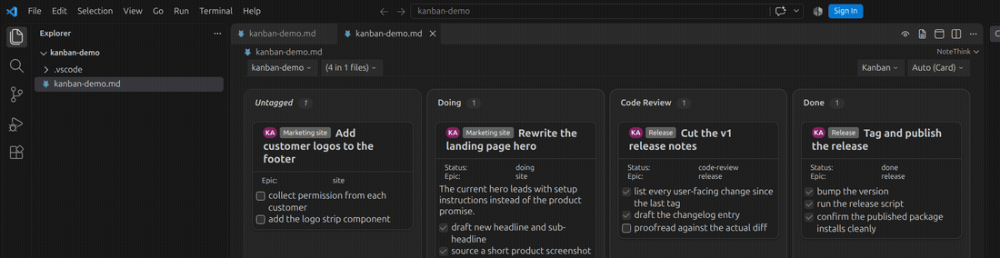
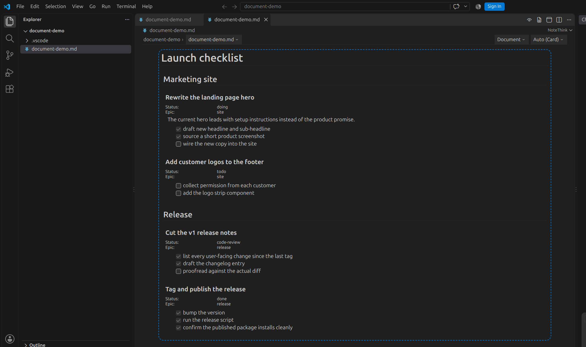
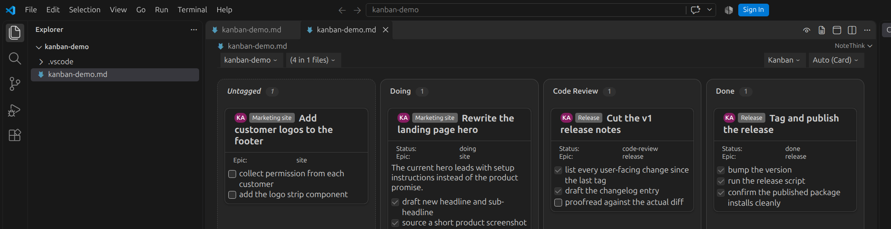
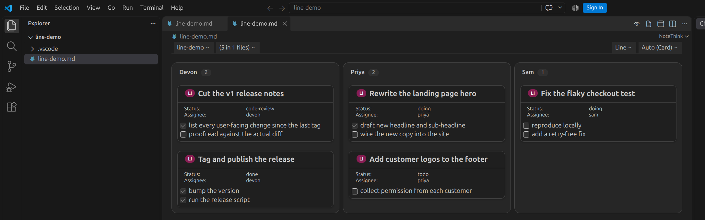

# NoteThink

Your `todo.md` is already a project board. NoteThink renders any markdown file - a plain
checklist, a full `todo.md` / `done.md` pair, a whole folder of them - as a live Kanban board,
a single-lane Line view, or a structured Document view, right inside VS Code. Nothing to sign
up for, nothing to sync: it reads the markdown you already have, live. Drag a card or tick a
checkbox and NoteThink writes exactly that change back to the file - nothing else changes
unless you drag or tick something yourself; it is not a free-text editor.



> **Status:** Preview / Beta - this is an early release. Expect rough edges.

## Install

- In VS Code, open the Extensions view (`Ctrl+Shift+X`), search for **NoteThink**, and click **Install**, or
- From the command line: `code --install-extension NoteThink.notethink`

Then open any `.md` file, right-click it and choose **Open With... -> NoteThink**.

## Features

- **Kanban and Line boards**: group stories by status, assignee, or any attribute you author - drag a card to rewrite its status (or grouping attribute) linetag in the file
- **Document view**: the same file read top to bottom, nested and structured
- **Folder mode**: aggregate every markdown file in a folder into one board
- **Live Updates**: edit the file in the normal text editor and the view updates in place, debounced
- **Agent activity**: see which AI coding agents (Claude Code, Codex, Grok) are working on which story, live, on desktop
- **Linetags**: plain markdown links carry status, epic, and other attributes invisibly - see [AUTHORING_GUIDE.md](./AUTHORING_GUIDE.md)
- **GFM + Frontmatter**: tables, strikethrough, task lists, footnotes, YAML/TOML frontmatter
- **Writes back two things, precisely**: a card drag and a checkbox click, and nothing else - see [Known Limitations](#known-limitations)

## Screenshots

| Document | Kanban | Line |
|---|---|---|
|  |  |  |

## Telemetry

NoteThink sends no telemetry. Nothing about how you use the extension leaves your machine.

## Full installation and setup

### From a .vsix (no Marketplace)

```bash
pnpm run package:vsix
code --install-extension notethink-<version>.vsix
```

### Opening a file

1. Open any markdown file (`.md`)
2. Use the command palette (`Ctrl+Shift+P`) and run "NoteThink: Open Viewer"
3. Or right-click on a markdown file and select "Open With..." → "NoteThink"

For the conventions your markdown should follow - heading levels, story
structure, linetag syntax, epics, Folder mode - see
[AUTHORING_GUIDE.md](./AUTHORING_GUIDE.md).

## Development

### Prerequisites

- [Node.js](https://nodejs.org/) 20+
- [pnpm](https://pnpm.io/) 9+
- [VS Code](https://code.visualstudio.com/)

### Setup

```bash
git clone https://github.com/ZoomBuzz/NoteThink.git
cd NoteThink
pnpm install
```

`postinstall` runs automatically and installs dependencies in the `client/extension`, `client/webview`, and `client/webview/src/notethink-views` sub-packages.

### Dev workflow

1. Open the repo in VS Code: `code .`
2. Press `F5` (or **Run > Start Debugging**). This launches "Run Web Extension" which:
   - Runs `pnpm run watch` (webpack in watch mode) as a pre-launch task
   - Opens a new Extension Development Host window
3. In the dev host, open any `.md` file and right-click → "Open With..." → "NoteThink"
4. Edit the markdown in the standard editor - the NoteThink view updates live (250ms debounce)
5. Code changes in `client/extension/src/` or `client/webview/src/` are recompiled automatically by webpack watch. Reload the dev host window (`Ctrl+R`) to pick them up.

### Inspecting the webview

The NoteThink view runs in a webview iframe. To inspect it:

- In the dev host: **Help > Toggle Developer Tools** (`Shift+Ctrl+I`)
- Enable debug logging in the console: `localStorage.debug = 'nodejs:*'`

For a fuller walkthrough - where host vs webview logs land, how the dev-only `notethink-extension.log` file works, and what to capture when filing a bug - see [docstech/bug-reports.md](docstech/bug-reports.md).

### Commands

| Command | Description |
|---------|-------------|
| `pnpm install` | Install all dependencies (root + sub-packages) |
| `pnpm run compile` | One-shot webpack build |
| `pnpm run watch` | Webpack watch mode (used by F5 launch) |
| `pnpm run package` | Production build (minified, hidden source maps) |
| `pnpm run lint` | ESLint |
| `pnpm test` | Run all unit tests (webview + notethink-views) |
| `pnpm run chrome` | Launch in browser via vscode-test-web (Chromium) |
| `pnpm run package:vsix` | Build a .vsix for local install |

### Testing

**Unit tests** (Jest):

```bash
pnpm test                        # all tests (35)
cd client/webview && pnpm test   # webview tests (14)
cd client/webview/src/notethink-views && pnpm test  # component library tests (21)
```

**Manual extension testing**: Press `F5`, then in the dev host:

- Open a `.md` file → right-click → "Open With..." → NoteThink
- Run "NoteThink: Open Viewer" from the command palette
- Check that headings, code blocks, lists, and task lists render
- Edit the file and verify the view updates
- Open Toggle Developer Tools and check for console errors

**Browser testing**: `pnpm run chrome` launches the extension in Chromium via vscode-test-web, opening the `docstech/` folder as a workspace.

### Building a .vsix

```bash
pnpm run package:vsix
```

This runs the production build (`vscode:prepublish`) then packages into `notethink-<version>.vsix`. Install locally with:

```bash
code --install-extension notethink-<version>.vsix
```

## Project Structure

```
notethink/
├── client/
│   ├── extension/           # VS Code extension (runs in webworker)
│   │   ├── src/
│   │   │   ├── extension.ts # entry point
│   │   │   ├── vscode/      # notethinkEditor, custom editor provider
│   │   │   └── lib/         # parseops, crypto, utils, errorops
│   │   └── dist/            # compiled output (gitignored)
│   │
│   └── webview/             # React webview (renders in iframe)
│       ├── src/
│       │   ├── components/  # ExtensionReceiver, NoteRenderer, App
│       │   └── notethink-views/  # component library (DocumentView, GenericNote, etc.)
│       └── dist/            # bundled webview (gitignored)
│
├── .github/workflows/ci.yml # CI: lint, test (webview + notethink-views)
├── webpack.config.js        # two configs: extension + webview
└── eslint.config.mjs
```

## Architecture

```
┌─────────────────────────────────────────────────────────────┐
│                        VS Code                              │
│  ┌───────────────────┐    ┌─────────────────────────────┐   │
│  │    Extension      │    │        Webview              │   │
│  │  (webworker)      │    │      (iframe)               │   │
│  │                   │    │                             │   │
│  │  ┌─────────────┐  │    │  ┌───────────────────────┐  │   │
│  │  │ notethink   │──┼────┼──│  ExtensionReceiver    │  │   │
│  │  │ Editor.ts   │  │    │  │  (hash-based delta)   │  │   │
│  │  └─────────────┘  │    │  └───────────┬───────────┘  │   │
│  │         │         │    │              │              │   │
│  │         ▼         │    │              ▼              │   │
│  │  ┌─────────────┐  │    │  ┌───────────────────────┐  │   │
│  │  │  parseops   │  │    │  │    NoteRenderer       │  │   │
│  │  │  crypto     │  │    │  │                       │  │   │
│  │  └─────────────┘  │    │  └───────────┬───────────┘  │   │
│  │                   │    │              │              │   │
│  └───────────────────┘    │              ▼              │   │
│                           │  ┌───────────────────────┐  │   │
│                           │  │   notethink-views     │  │   │
│                           │  │   (React.memo'd)      │  │   │
│                           │  └───────────────────────┘  │   │
│                           └─────────────────────────────┘   │
└─────────────────────────────────────────────────────────────┘
```

**Data flow:**
1. Extension finds all `*.md` files, parses each to MDAST, computes SHA-256 hash
2. Docs sent to webview via `postMessage`
3. `ExtensionReceiver` compares hashes - unchanged docs are skipped
4. `NoteRenderer` converts MDAST to NoteProps hierarchy via `convertMdastToNoteHierarchy`
5. `DocumentView` and `GenericNote` (both `React.memo`'d) render the note tree

## Agent activity

The `agent` card type shows which AI coding agents are working on a story, live, by reading each
vendor's own local session files directly on disk - desktop only, and only while a panel is drawing
an `agent` card. NoteThink reads no network endpoint for this and no vendor is asked to write
anything for NoteThink to find. The files read, when present:

- **Claude Code**: `~/.claude/sessions/*.json` (which sessions are live, and whether each is working,
  idle or waiting on you) and `~/.claude/projects/*/*.jsonl` (each session's transcript, including
  its `subagents/` directory)
- **Codex**: `~/.codex/sessions/YYYY/MM/DD/*.jsonl` (each session's rollout transcript)
- **Grok**: `~/.grok/active_sessions.json` (which sessions are live), `~/.grok/sessions/*/*/events.jsonl`
  (each session's tool and permission timeline) and the matching `usage.json` where one exists

Transcripts from the last 30 days are read; a vendor with none of the files above present is simply
never read from. The card also reads the working tree of every git repository open in the workspace,
through VS Code's built-in git extension, to show uncommitted files with their added and removed
line counts. It also reads the commits each session made, though the card does not draw them.

A session appears on a story's card when one of its own file edits changed that story's section of a
story board, `docstech/users/<name>/todo.md` or `done.md`, in the workspace folder or in any project
directly inside it. A story is matched by its `[](?id=...)` linetag, or by the id derived from its
title when it has none, so a story keeps its agents when it moves from `todo.md` to `done.md`. A
session that edited no story is drawn on a card of its own rather than guessed onto one.

Clicking an agent on a card opens that session in VS Code: in Claude Code's own chat panel, or, for a
vendor with no such panel, as the session's transcript in an editor.

## Known Limitations

- **Not a text editor**: NoteThink writes back exactly two kinds of change - dragging a card in Kanban or Line view rewrites its status (or grouping attribute) linetag, plus an `nt_kanban_ordering_weight` linetag to remember the drop position, and clicking a checkbox toggles it in the source. It never edits body text, headings, or anything else, and nothing changes unless you drag a card or tick a checkbox yourself

## Contributing

See [CODING_STANDARDS.md](./CODING_STANDARDS.md) for code style guidelines and [AGENTS.md](./AGENTS.md) for project conventions.

## License

Apache-2.0
